# Manual de funcionalidades - Soneca PWA

Este documento descreve as funcionalidades atuais do aplicativo. Os prints abaixo foram gerados em uma base demonstrativa para documentacao, sem alterar os registros reais da planilha.

## Tela inicial

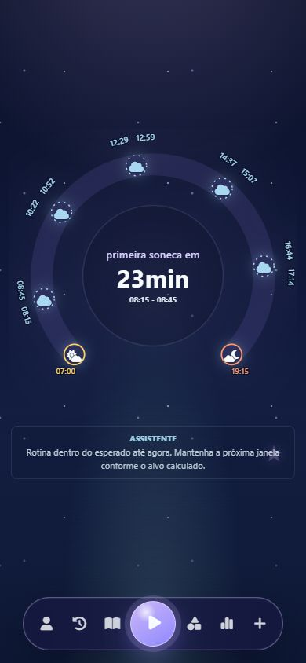

A tela inicial mostra a rotina do ciclo atual do dia:

- Assistente: frase curta com leitura da rotina, sinais de sono, mamada, tummy time ou sono noturno.
- Concha do dia: linha do tempo entre o inicio do dia e a hora de dormir configurada.
- Inicio do dia: aparece no lado esquerdo da concha, com icone de amanhecer.
- Fim do dia / sono noturno: aparece no lado direito, com icone de entardecer.
- Sonecas feitas: aparecem no arco como marcadores de soneca.
- Sonecas futuras: aparecem como previsao tracejada, com horario provavel da janela.
- Mamadas: aparecem na concha com icone proprio.
- Tummy time: pode aparecer como atividade acordada no ciclo do dia.
- Centro da concha: mostra a proxima soneca, janela aberta, soneca ativa ou sono noturno ativo. Tambem mostra a ultima mamada em formato de tempo decorrido.

Quando uma soneca esta ativa, o centro da concha vira cronometro: `dormindo ha X min`. O app tambem mostra a meta da soneca e quanto falta para atingir essa meta.

## Barra inferior

A barra inferior fica flutuante no rodape e concentra a navegacao:

- Perfil: dados da bebe e configuracoes.
- Historico: registros por data.
- Diario do sono: detalhes qualitativos das sonecas.
- Start: acoes principais de registro.
- Atividades: sugestoes para a idade.
- Relatorio: estatisticas semanais.
- Instalar: instrucoes para instalar no iPhone.

Quando um menu e aberto, a barra e ocultada para nao cobrir botoes do painel.

## Start e registros rapidos

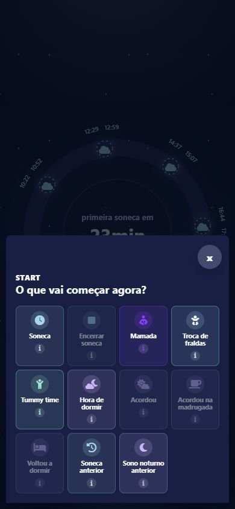

O botao central abre as principais acoes:

- Soneca: inicia uma soneca.
- Encerrar soneca: finaliza a soneca ativa e pede o humor ao acordar.
- Mamada: registra horario, tipo e lado.
- Troca de fraldas: registra xixi, coco ou xixi e coco.
- Tummy time: registra uma atividade acordada.
- Hora de dormir: inicia o sono noturno.
- Acordou: encerra o sono noturno e inicia um novo ciclo do dia.
- Acordou na madrugada: marca uma pausa acordada durante o sono noturno.
- Voltou a dormir: fecha a pausa acordada e continua o sono noturno.
- Soneca anterior: permite inserir ou corrigir uma soneca passada.
- Sono noturno anterior: permite inserir uma noite passada.

Os icones de informacao explicam rapidamente cada botao.

## Iniciar soneca

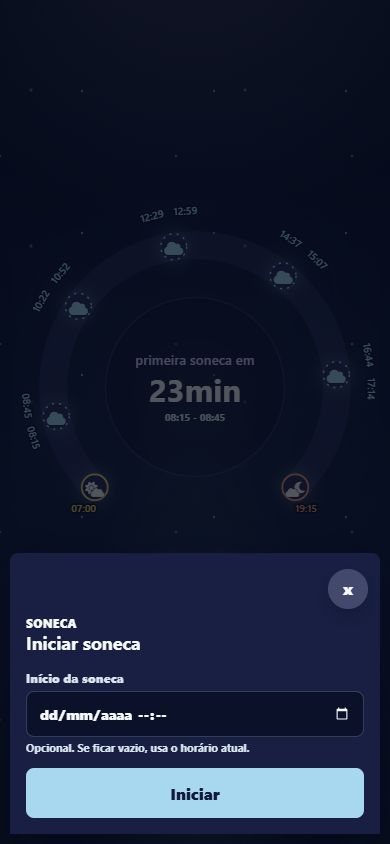

Ao tocar em `Soneca`, o app abre um campo opcional de horario:

- Se o horario ficar vazio, a soneca comeca com a hora atual.
- Se voce preencher um horario anterior, o cronometro ja comeca contando desde esse horario.

Ao encerrar a soneca, o app calcula duracao, janela real usada, impacto no sono diurno e proxima previsao. Tambem salva localmente e tenta sincronizar com Google Sheets.

## Mamada

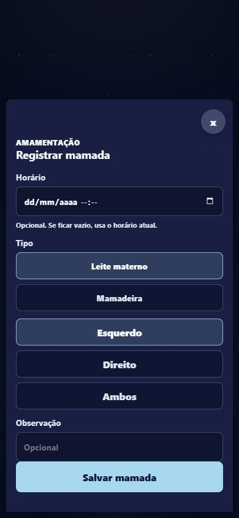

O registro de mamada permite:

- Informar horario anterior ou usar a hora atual.
- Selecionar tipo: leite materno, mamadeira ou formula, conforme opcoes ativadas no perfil.
- Selecionar lado quando for leite materno: esquerdo, direito ou ambos.
- Adicionar observacao opcional.

As mamadas aparecem na concha do dia. Se acontecerem perto do sono noturno, tambem podem aparecer na concha da noite.

## Sono noturno

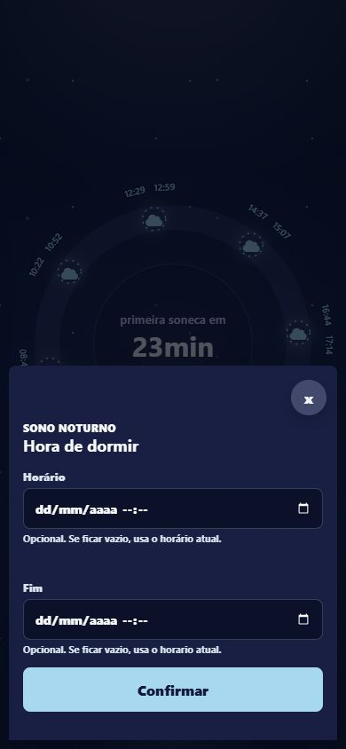

`Hora de dormir` inicia o sono noturno. O campo de horario e opcional:

- Vazio: usa o horario atual.
- Preenchido: usa o horario informado.

Durante sono noturno ativo:

- O assistente nao calcula janela de soneca.
- O app nao envia notificacoes de janela de soneca.
- A concha noturna mostra quanto tempo ela esta dormindo.
- Mamadas e despertares noturnos ficam associados a noite.

`Acordou na madrugada` e `Voltou a dormir` registram periodos acordados. Esse tempo e descontado do sono noturno efetivo. Se ela despertar as 5h ou 6h, isso continua sendo despertar noturno enquanto a noite estiver ativa. O inicio do dia so muda quando voce tocar em `Acordou` ou editar o inicio do dia no perfil.

## Perfil

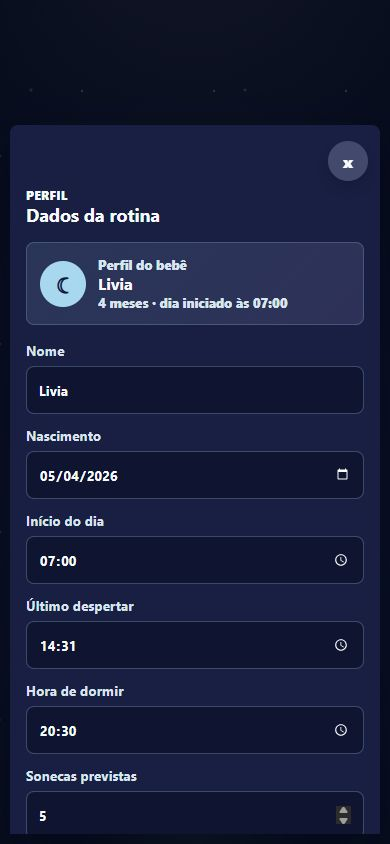

O perfil controla a base dos calculos:

- Nome.
- Data de nascimento: usada para calcular a idade em meses.
- Inicio do dia: define o ciclo atual. Pode ser editado manualmente.
- Ultimo despertar: considera a ultima soneca feita, nao o sono noturno.
- Hora de dormir: horario preferido para o sono noturno.
- Sonecas previstas: quantidade planejada para o dia, com padrao 5.
- Opcoes de amamentacao: mostra apenas os tipos usados/ativados.
- Avisos: botao para ativar notificacoes locais/remotas quando suportado.

O perfil tambem mostra sono diurno, ultima noite, tempo acordada, humor geral, janela media e uma observacao do assistente.

## Historico

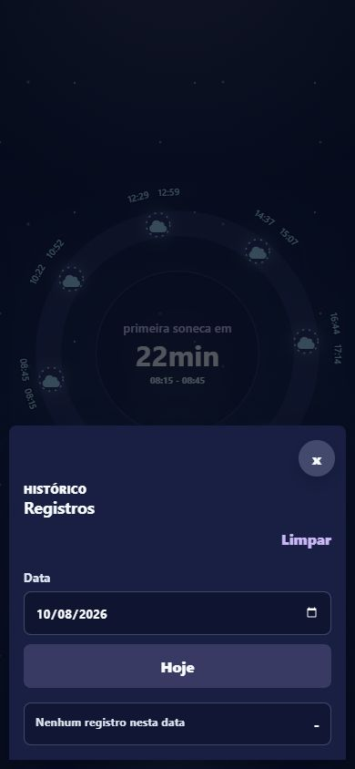

O historico lista registros por data:

- Sonecas.
- Sono noturno.
- Mamadas.
- Trocas de fralda.

E possivel filtrar por data, voltar para hoje e excluir registros duplicados ou incorretos. Ao excluir, o app remove localmente e tenta remover/sincronizar com a planilha quando o registro existir no Google Sheets.

## Diario do sono

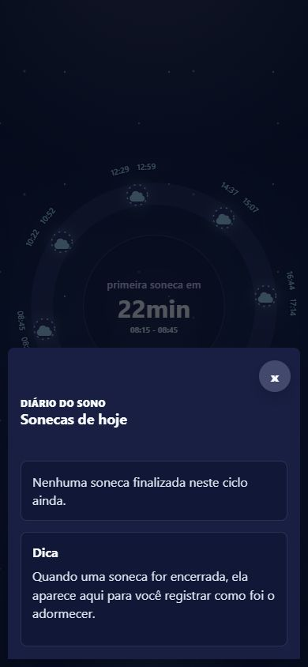

O diario lista as sonecas finalizadas do ciclo atual. Para cada soneca, e possivel registrar:

- Onde terminou de dormir: colo, berco com ajuda ou berco sozinha.
- Humor ao acordar: feliz, calma, irritada ou chorando.
- Tempo para dormir em minutos.
- Se usou chupeta para dormir.
- Se acordou quando a chupeta caiu.
- Duracao da soneca.
- Janela de sono usada.
- Mamada antes da soneca.
- Tipo de ajuda: colo, balanco, mao no peito, chupeta, voz ou shhhh.

Esses dados alimentam estatisticas e ajudam a observar a evolucao do treino de sono, como migrar de colo para berco com ajuda e depois berco sozinha.

## Atividades para idade

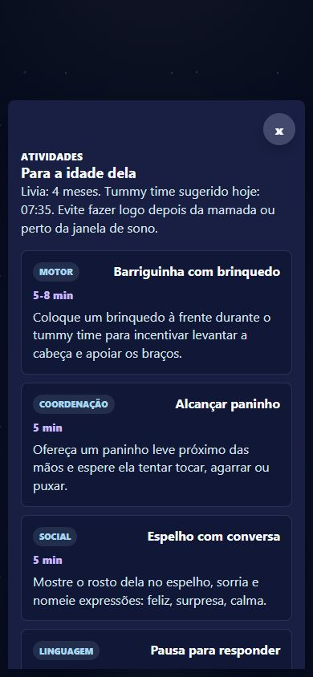

A aba de atividades sugere brincadeiras de acordo com a idade calculada pela data de nascimento. Ela inclui exemplos por area de desenvolvimento, como motor, visual, linguagem, coordenacao e social.

O tummy time tambem pode ser registrado pelo Start. Ele nao altera diretamente a janela de sono, mas o assistente pode sugerir bons momentos depois de uma mamada ou de um despertar, quando nao houver soneca ou sono noturno ativo.

## Relatorio semanal

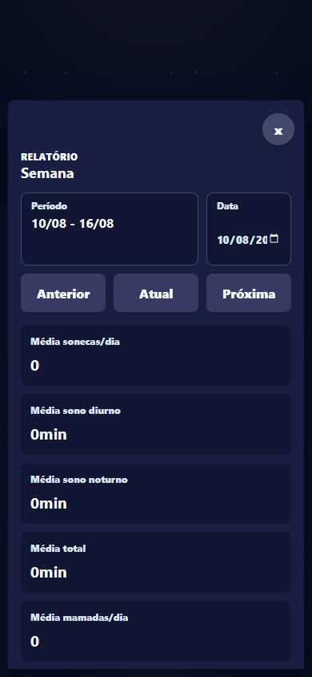

O relatorio e baseado na semana selecionada. A semana fecha no domingo e a proxima semana comeca em seguida.

Indicadores atuais:

- Media de sonecas por dia.
- Media de sono diurno.
- Media de sono noturno.
- Media de sono total.
- Media de mamadas por dia.
- Tempo acordada a noite.
- Tempo acordada no dia.
- Janela real media.
- Tempo para adormecer.
- Humor ao acordar.
- Ultima janela antes da noite.
- Numero de despertares por noite.
- Percentual da meta das sonecas.
- Trocas de fralda por dia.
- Fraldas com coco por dia.
- So xixi, so coco e xixi+coco.

O grafico principal junta sono diurno, sono noturno, sono total, quantidade de sonecas, mamadas e despertares para facilitar comparacao por dia da semana.

## Instalar no iPhone

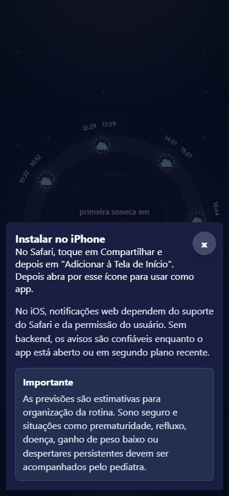

No iPhone, a instalacao deve ser feita pelo Safari:

1. Abra a URL do app no Safari.
2. Toque em Compartilhar.
3. Toque em `Adicionar a Tela de Inicio`.
4. Abra pelo icone criado.

As notificacoes web no iOS dependem do suporte do Safari, permissao do usuario e instalacao como PWA. Sem backend/push remoto, avisos locais sao mais confiaveis enquanto o app esta aberto ou em segundo plano recente.

## Google Sheets

O app sincroniza com Google Sheets via Apps Script. Os principais conjuntos de dados sao:

- Sono e sonecas.
- Mamadas.
- Fraldas.
- Diario do sono.
- Sessao ativa, para outro celular acompanhar e encerrar timer ativo.

O app salva primeiro no aparelho e depois tenta enviar para a planilha. Quando a sincronizacao remota esta disponivel, outro celular consegue carregar registros e timers ativos a partir da planilha.

## Regras importantes de calculo

- O ciclo do dia comeca no horario definido por voce, normalmente ao tocar em `Acordou`.
- Despertar de madrugada nao inicia automaticamente o dia, mesmo se for as 5h ou 6h.
- Sono noturno ativo bloqueia calculo e notificacao de novas sonecas.
- Despertares noturnos sao descontados do tempo efetivo de sono noturno.
- A quantidade de sonecas previstas do perfil limita as sugestoes principais do dia, mas o app pode indicar uma soneca extra se os registros mostrarem necessidade antes da noite.
- A ultima soneca do dia considera a hora de dormir configurada e a rotina antes do sono noturno.
- As janelas sao personalizadas pelo historico da bebe quando ha registros parecidos suficientes; quando nao ha, o app usa a faixa por idade.

